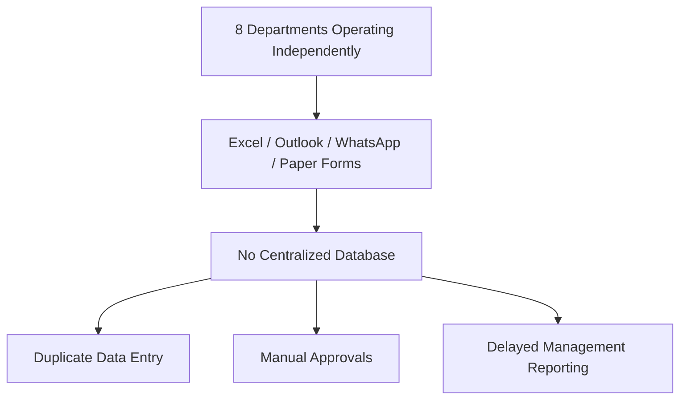
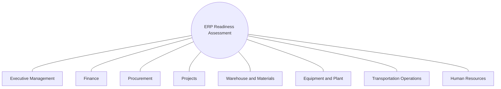

# ERP Readiness Assessment — Construction & Transportation

---

## Overview

A business process assessment and ERP readiness evaluation for a newly established Saudi General Contracting & Transportation company, conducted to understand current operations, identify process gaps, document business requirements, and define the functional scope and roadmap for a future ERP implementation. The diagnostic phase is complete; the ERP system itself has not yet been selected or implemented.

---

## Business Context

The company operates across general residential building construction, government building construction, airport construction and infrastructure, specialized transportation, intercity passenger bus transportation, and urban rail passenger transportation. As a newly established organization experiencing rapid growth and preparing to run multiple projects simultaneously, the company had no ERP system in place — business operations ran on Microsoft Excel, Outlook, WhatsApp, paper-based forms, and shared folders. Management commissioned this assessment to evaluate readiness before committing to an ERP platform.

---

## Objectives

- Assess ERP implementation readiness across the organization.
- Understand current business processes as actually practiced.
- Identify operational gaps and inefficiencies.
- Gather business requirements directly from stakeholders.
- Design future-state (TO-BE) business processes.
- Recommend ERP functional scope, phased by priority.
- Develop a high-level ERP implementation roadmap.

---

## My Role

**Title:** Business Systems Analyst
**Company:** Abeer Adam Abdullah Trading Est.
**Duration:** Jan 2026 – Present

Represented the business side throughout the assessment: conducting stakeholder interviews, facilitating requirements workshops, documenting AS-IS processes, designing TO-BE workflows, performing gap analysis, preparing the BRD, recommending ERP functional modules, supporting vendor evaluation, and presenting findings to management.

---

## Departments Assessed

| Department | Key Current-State Challenges Identified |
|---|---|
| Executive Management | No executive dashboards; limited financial visibility, project profitability tracking, cash flow reporting, or portfolio performance view |
| Finance | Heavy reliance on Excel, manual journal entries, delayed financial reporting, limited project cost visibility, manual budget tracking |
| Procurement | Purchase requests via email/paper, no structured approval workflow, limited supplier performance tracking, difficulty monitoring PO status |
| Projects | Project costs tracked manually, no centralized budget monitoring, limited progress visibility, difficulty comparing budget vs. actual, delayed management reporting |
| Warehouse & Materials | Manual material requests, limited visibility of availability, delayed receipt/issue recording, difficulty tracking consumption by project, weak procurement-to-project integration |
| Equipment & Plant | Manual equipment allocation, no centralized maintenance schedule, limited availability visibility, difficulty monitoring utilization across projects |
| Transportation Operations | Manual vehicle scheduling, fuel consumption tracked separately, independent maintenance records, driver scheduling not integrated with operations |
| Human Resources | Manual employee records, leave requests outside a centralized system, separate attendance tracking, manual payroll reconciliation |

---

## Assessment Activities

- Stakeholder Interviews
- Business Process Mapping
- AS-IS Process Documentation
- TO-BE Process Design
- Gap Analysis
- Business Requirements Gathering
- Functional Requirements Documentation
- ERP Readiness Assessment
- ERP Scope Definition
- ERP Implementation Roadmap (high-level)

---

## Current Systems (AS-IS)

No ERP solution existed. Business operations relied entirely on Microsoft Excel, Microsoft Outlook, WhatsApp, paper-based forms, and shared folders — with departments operating independently and no centralized business database.

---

## Key Business Challenges Identified

- Departments operate independently with no centralized business database.
- Duplicate data entry across departments.
- Manual approval processes throughout.
- Limited project cost visibility.
- Weak integration between procurement and project material usage.
- Delayed management reporting.
- Limited operational dashboards.
- Inconsistent business processes across functions.
- Heavy dependency on spreadsheets for core operations.

---

## Recommended ERP Functional Scope (Phased)

**Phase 1:** Finance, Procurement, Projects, Material Management, Document Management, Approval Workflows.

**Phase 2:** Human Resources, Payroll, Equipment Maintenance, Fleet Management.

**Phase 3:** Executive Dashboards, Business Intelligence, Mobile Access, Vendor Portal.

The phasing reflects prioritizing core financial, procurement, and project cost control first, with people/asset management and executive-level analytics following in later phases.

---

## Deliverables

- ERP Readiness Assessment Report
- Business Requirements Document (BRD)
- Functional Requirements Specification
- AS-IS Process Maps
- TO-BE Process Maps
- Gap Analysis Report
- Stakeholder Analysis
- ERP Functional Scope Recommendation
- High-Level ERP Implementation Roadmap

---

## Current Status

The readiness assessment and diagnostic phase is **complete**, with all deliverables above produced and presented to management. **The ERP system itself has not yet been selected, configured, or implemented.** Vendor evaluation support is part of the ongoing scope of this role, but no vendor has been confirmed as selected as of this writing. This project should be read as a completed diagnostic engagement feeding into a not-yet-started implementation — not as a completed ERP implementation.

---

## Anticipated Business Impact

The assessment gave management the operational visibility and documented requirements needed to make informed ERP selection and implementation decisions — replacing ad hoc, spreadsheet-driven operations across finance, procurement, project cost tracking, materials, equipment, transportation, and HR with a phased, prioritized path to a centralized system. No implementation-stage outcomes exist yet, since the system itself has not been built or deployed.

---

## Visual Documentation

*Diagrams below reflect only structure confirmed in this dossier's Evidence Mapping.*

### AS-IS State — Current Operating Reality

### Stakeholder Map — Departments Assessed

### Recommended ERP Functional Scope — Phased

```mermaid
flowchart LR
    subgraph Phase1[Phase 1]
        F1[Finance]
        P1[Procurement]
        PR1[Projects]
        M1[Material Management]
        D1[Document Management]
        A1[Approval Workflows]
    end
    subgraph Phase2[Phase 2]
        HR2[Human Resources]
        PAY2[Payroll]
        EQ2[Equipment Maintenance]
        FL2[Fleet Management]
    end
    subgraph Phase3[Phase 3]
        BI3[Executive Dashboards / BI]
        MOB3[Mobile Access]
        VP3[Vendor Portal]
    end
    Phase1 --> Phase2 --> Phase3
```

### Before vs. Recommended Capability — By Department (Sample)

| Department | Current Challenge (AS-IS) | Recommended Capability (TO-BE) |
|---|---|---|
| Finance | Manual journal entries, delayed reporting | Centralized financial module, real-time reporting |
| Procurement | Email/paper purchase requests, no approval workflow | Structured approval workflow, PO status tracking |
| Projects | Manual cost tracking, no budget-vs-actual visibility | Centralized project budget monitoring |
| Warehouse & Materials | Manual requests, delayed receipt/issue recording | Real-time material tracking by project |
| Equipment & Plant | Manual allocation, no maintenance schedule | Centralized equipment maintenance and utilization tracking |

*Full department-level detail is available in the Departments Assessed section above; this table samples the pattern rather than repeating all eight in visual form.*

---

## Skills Demonstrated

- ERP Readiness Assessment
- Stakeholder Interviewing and Requirements Workshops
- AS-IS / TO-BE Process Documentation
- Gap Analysis (cross-departmental, 8 functional areas)
- Business Requirements Documentation (BRD)
- Functional Requirements Specification
- ERP Functional Scope Definition and Phased Roadmap Planning
- Vendor Evaluation Support
- Executive Presentation of Findings

